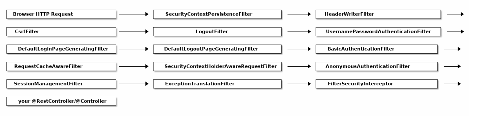

Basics of Spring Security
--

1. CSRF
2. JWT
3. OAuth
4. OAuth2

`Content-Disposition: attachment; filename="filename.jpg"`
Первая часть говорит браузеру, что документ должен быть скачан, а вторая указывает оригинальное название

```
POST /test.html HTTP/1.1
Host: example.org
Content-Type: multipart/form-data;boundary="boundary"
--boundary
Content-Disposition: form-data; name="field1"
value1
--boundary
Content-Disposition: form-data; name="field2"; filename="example.txt"
value2
--boundary--
```
Следующие хедеры не вызывают preflight запросов:
```
Accept
Accept-Language
Content-Language
Content-Type whose value, once parsed, has a MIME type (ignoring parameters) that is application/x-www-form-urlencoded, multipart/form-data, or text/plain
```
[Spring CSRF article](https://docs.spring.io/spring-security/site/docs/5.0.x/reference/html/csrf.html)

Полезные статьи по устройству Spring Security:
<https://www.marcobehler.com/guides/spring-security>
<https://habr.com/ru/post/346628/>

Концепция фильтров в Spring Security: 


https://www.baeldung.com/security-spring
https://medium.com/javarevisited/all-you-need-to-know-about-spring-security-basics-aea98c680d01
https://www.javainuse.com/webseries/spring-security-jwt/chap3